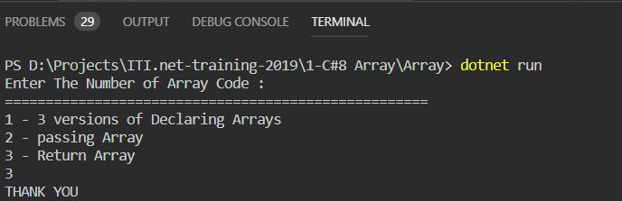

# In the Name Of ALLAH

## __Arrays__

- In programs, arrays are inside many things. 
- An array has an element type. Its elements are accessed with an index.
- An array cannot be resized—it can only be created (and then replaced).

## String Arrays

- We begin with string arrays.
-  Square brackets are used for all arrays.
 ~~~
 example[]
 ~~~

- The syntax is simple and easy to remember (with practice).
- __Version 1:__
This code creates a string array of 3 elements, and then assign strings to the array indexes (starting at 0).

- __Version 2:__
This string array is created with an array initializer expression. It is shorter and easier to type.
- __Version 3:__ Here we do not even declare the type of the array. The 3 versions are compiled to the same instructions.
```
using System;

class Program
{
    static void Main()
    {
        // Version 1: create empty string array, then assign into it.
        string[] animals = new string[3];
        animals[0] = "deer";
        animals[1] = "moose";
        animals[2] = "boars";
        Console.WriteLine("ARRAY 1: " + animals.Length);

        // Version 2: use array initializer.
        string[] animals2 = new string[] { "deer", "moose", "boars" };
        Console.WriteLine("ARRAY 2: " + animals2.Length);

        // Version 3: a shorter array initializer.
        string[] animals3 = { "deer", "moose", "boars" };
        Console.WriteLine("ARRAY 3: " + animals3.Length);
    }
}
```


## Int array, parameter.
 - Here is an int array that is passed as a parameter. 
 - The entire contents of the array are not copied—just the small reference.
> Tip:
We can think of an array as a class with a variable number of fields, each accessed with an index.
C# program that receives array parameter

```
using System;

class Program
{
    static void Main()
    {
        // Three-element array.
        int[] array = { -5, -6, -7 };
        // Pass array to Method.
        Console.WriteLine(Method(array));
    }

    /// <summary>
    /// Receive array parameter.
    /// </summary>
    static int Method(int[] array)
    {
        return array[0] * 2;
    }
}
```


## Return
-  We can return arrays from methods.
-  In this example program, we allocate a two-element array of strings in Method(). 
- Then, after assigning its elements, we return it.
C# program that returns array reference
```
using System;

class Program
{
    static void Main()
    {
        // Write array from Method.
        Console.WriteLine(string.Join(" ", Method()));
    }

    /// <summary>
    /// Return an array.
    /// </summary>
    static string[] Method()
    {
        string[] array = new string[2];
        array[0] = "THANK";
        array[1] = "YOU";
        return array;
    }
}
```


